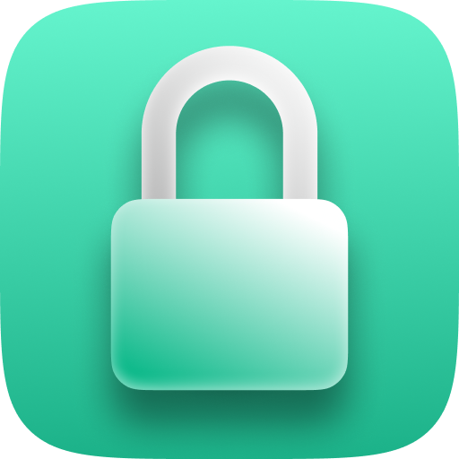

<h1 align="center">Definitive Password Generator</h1>

## A complete password generator built for Windows with Electron.

Definitive Password Generator is a simple and lightweight app built with Electron (currently only available for Windows) that generates random and secure passwords for your needs.

## Installation
Download from [Github Releases](https://github.com/juninholiveira/definitive-password-generator/releases) page

## Features

- Simple, lightweight and fast
- Has a Tray icon, where you can right-click to generate a quick password that is automatically copied to the clipboard
- Password is generated based on the specified parameters:
    - Character amount: The number of characters to use on the password (16 is a good number)
    - Include Symbols: Whether or not to include special characters
    - Include Numbers: Whether or not to include numbers
    - Include Uppercase: Whether or not to include Upper-Case characters
    - Include Lowercase: Whether or not to include Lower-Case characters
    - Exclude Similar: excludes characters visually similar, such as "i l L o O 0". This is recomended, since some fonts used in passwords fields might be confusing to identify
    - Exclude Ambiguous: Exclude special characters that might be problematic in passwords
- Parameters are saved locally on your machine at "C:/Users/%USERPROFILE%/AppData/Roaming/Definitive Password Generator". So next time you open the app, it will restore the previous parameters.

Reminder: closing the app on the top-right corner X will only close the window. The app will still run on the Tray, for you to generate passwords more quickly. For you to really close the app, just right-click on the Tray icon and choose "Quit".

## Contribution
Want help me make DPG available in other operational systems? Feel free to make a Pull Request!

## Feeling generous? :D

